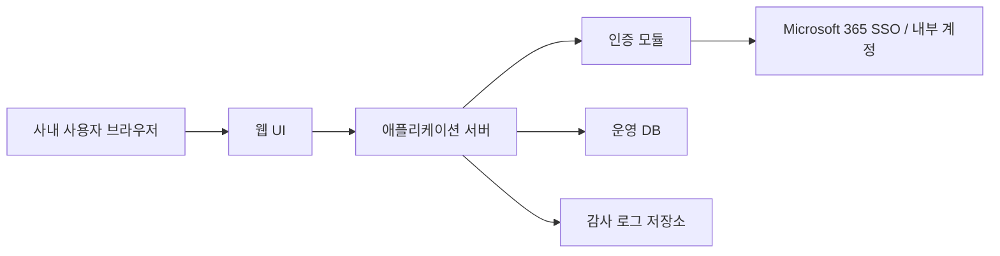

# 시스템 아키텍처

## 1. 문서 목적
- 본 문서는 사내 IP 관리 시스템의 목적, 운영 범위, 개발/운영 환경, 시스템 구성 요소와 상호 관계를 최신 기준으로 정의한다.
- 본 문서는 항상 최신 상태만 유지한다.
- 본 문서의 변경으로 개발 영향이 발생하는 경우 `2.Dev_Design.md`를 함께 갱신한 뒤 구현을 진행한다.

## 2. 시스템 목적
- 사내 내부망에서 사용 가능한 IP 자원을 중앙에서 조회, 추가, 수정, 삭제할 수 있도록 제공한다.
- IP 자원의 사용 상태와 관리 이력을 표준화하여 중복 할당, 누락, 수기 관리 오류를 줄인다.
- 사용자 권한을 `슈퍼관리자`, `관리자`, `사용자`로 구분하여 역할 기반 접근 제어를 제공한다.
- Microsoft 365 SSO 또는 내부 계정 로그인을 통해 사용자 인증을 일원화한다.

## 3. 적용 범위
- 사내 내부망에서만 접근 가능한 웹 기반 시스템
- 서버에 접속하여 브라우저로 사용하는 중앙형 업무 시스템
- 관리 대상: 네트워크 대역, IP 주소, 사용 상태, 할당 대상, 변경 이력, 사용자/권한

## 4. 주요 개발/운영 환경
### 4.1 운영 환경
- 접속 환경: 사내 업무용 PC 브라우저
- 네트워크: 사내 내부망 전용
- 서버 형태: 사내 VM 또는 물리 서버
- 인증 연동: Microsoft 365 SSO(Entra ID 기반) 또는 내부 계정 인증
- 데이터 저장소: 운영 DB와 감사 로그 저장소

### 4.2 개발 환경
- 개발/검증/운영 환경을 논리적으로 분리한다.
- 인증 연동은 개발 환경에서 테스트 테넌트 또는 내부 계정 모드로 검증 가능해야 한다.
- 배포 전 검증 항목에는 권한, IP CRUD, 감사 로그, 로그인 흐름이 포함되어야 한다.

## 5. 구성 요소
### 5.1 사용자 계층
- `사용자 브라우저`: 조회 중심 사용
- `관리자 브라우저`: IP 등록/수정/삭제 및 운영 관리
- `슈퍼관리자 브라우저`: 관리자 기능 포함, 권한 및 시스템 정책 관리

### 5.2 서비스 계층
- `웹 UI`: 사용자 요청 입력, 조회 결과 표시, 권한별 메뉴 제어
- `애플리케이션 서버`: 인증 처리, 권한 판정, IP 자원 비즈니스 로직 수행
- `인증 모듈`: Microsoft 365 SSO 또는 내부 계정 로그인 처리
- `감사 로그 모듈`: 주요 행위의 전후 상태 및 수행 주체 기록

### 5.3 데이터 계층
- `운영 DB`: IP 대역, IP 주소, 사용자, 권한, 할당 정보 저장
- `감사 로그 저장소`: 로그인, CRUD, 권한 변경 이력 저장

## 6. 구성 요소 관계

## 7. 관계 정의
- 모든 사용자는 브라우저를 통해 웹 UI에 접속한다.
- 웹 UI는 모든 업무 요청을 애플리케이션 서버로 전달한다.
- 애플리케이션 서버는 인증 모듈을 통해 사용자 신원을 확인하고 권한을 판정한다.
- 인증 완료 후 애플리케이션 서버는 운영 DB에서 IP 자원과 사용자/권한 데이터를 조회하거나 갱신한다.
- 로그인, IP 추가/수정/삭제, 권한 변경과 같은 중요 행위는 감사 로그 저장소에 기록한다.
- Microsoft 365 SSO 사용 시 애플리케이션 서버는 사내 정책에 허용된 방식으로 Entra ID와 통신해야 한다.

## 8. 보안 및 운영 원칙
- 시스템은 내부망에서만 접근 가능해야 한다.
- 인증되지 않은 사용자는 시스템 기능에 접근할 수 없다.
- 권한 없는 사용자는 IP 변경 및 사용자 권한 변경을 수행할 수 없다.
- 삭제 기능은 논리 삭제 또는 이력 보존이 가능한 방식으로 설계해야 한다.
- 운영 중 발생한 구조 변경은 본 문서와 `1.Function_Design.md`, `2.Dev_Design.md`에 즉시 반영되어야 한다.
