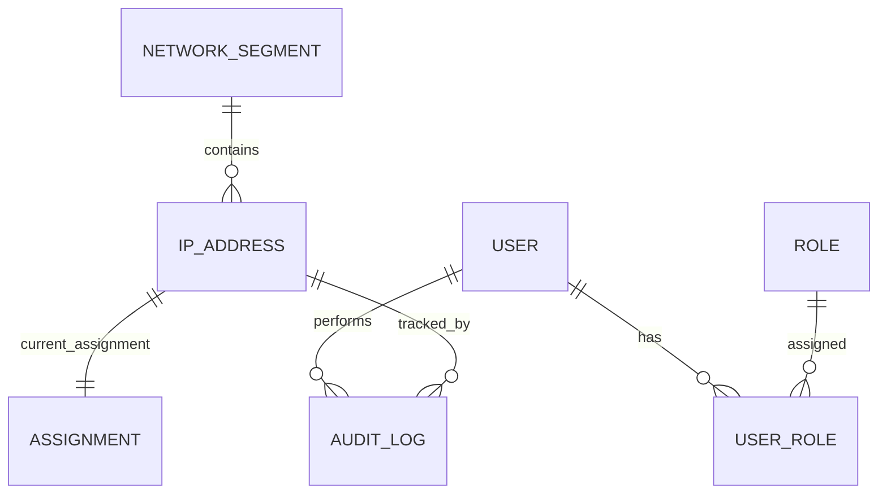

# 기능 명세서

## 1. 문서 목적
- 본 문서는 시스템이 제공하는 기능의 목적, 기능 내용, 기능 수행에 필요한 정보 관계를 최신 기준으로 정의한다.
- 본 문서는 항상 최신 상태만 유지한다.
- 본 문서가 변경되면 구현 영향 여부를 검토하고 `2.Dev_Design.md`를 함께 갱신한 뒤 구현을 진행한다.

## 2. 사용자 권한 정의
| 권한 | 목적 | 주요 가능 기능 |
| --- | --- | --- |
| 슈퍼관리자 | 시스템 정책 및 권한 통제 | 전체 기능, 관리자 권한 부여/회수, 시스템 설정 |
| 관리자 | IP 자원 운영 관리 | IP 조회/추가/수정/삭제, 대역 관리, 할당 상태 관리 |
| 사용자 | 자원 조회 및 확인 | 허용 범위 내 IP 조회, 상세 확인 |

## 3. 기능 목록
### 3.1 로그인
- 목적: 사용자 신원을 확인하고 적절한 권한을 부여한다.
- 내용:
  - Microsoft 365 SSO 로그인
  - 내부 계정 로그인
  - 로그인 성공 후 권한별 초기 화면 진입
  - 로그인/실패 이력 기록

### 3.2 로그아웃
- 목적: 사용자 세션을 안전하게 종료한다.
- 내용:
  - 현재 세션 종료
  - 필요 시 SSO 세션 종료 연동
  - 로그아웃 이력 기록

### 3.3 IP 목록 조회
- 목적: 사용 가능한 IP와 사용 중인 IP를 조건별로 확인한다.
- 내용:
  - 대역, 상태, 사용 부서, 호스트명, 담당자 기준 검색
  - 사용 가능/사용 중/예약/비활성 상태 필터
  - 상세 정보 확인

### 3.4 IP 등록
- 목적: 신규 IP 자원을 시스템에 등록한다.
- 내용:
  - 대상 대역 선택
  - IP 주소, 호스트명, 상태, 설명, 담당 정보 입력
  - 중복 IP 검증
  - 등록 이력 기록

### 3.5 IP 수정
- 목적: 기존 IP 자원의 속성을 최신 정보로 갱신한다.
- 내용:
  - 상태 변경
  - 호스트명, 설명, 담당자, 부서 정보 수정
  - 변경 전/후 값 이력 기록

### 3.6 IP 삭제
- 목적: 더 이상 사용하지 않는 IP 자원을 운영 목록에서 제외한다.
- 내용:
  - 삭제 가능 여부 검증
  - 논리 삭제 또는 비활성 처리
  - 삭제 사유 및 수행자 기록

### 3.7 네트워크 대역 관리
- 목적: IP 주소가 소속되는 관리 단위를 정의한다.
- 내용:
  - 대역명, CIDR, 게이트웨이, VLAN, 설명 관리
  - 대역별 사용량 확인
  - 대역 활성/비활성 관리

### 3.8 사용자 및 권한 관리
- 목적: 시스템 접근 가능 사용자와 역할을 통제한다.
- 내용:
  - 사용자 등록/비활성
  - 역할 부여/회수
  - SSO 계정과 내부 계정 매핑 관리
  - 권한 변경 이력 기록

### 3.9 감사 로그 조회
- 목적: 주요 변경과 접근 이력을 추적한다.
- 내용:
  - 로그인, IP CRUD, 권한 변경 로그 조회
  - 기간, 사용자, 기능, 대상 기준 검색

## 4. 기능별 권한 매트릭스
| 기능 | 슈퍼관리자 | 관리자 | 사용자 |
| --- | --- | --- | --- |
| 로그인/로그아웃 | O | O | O |
| IP 목록 조회 | O | O | O |
| IP 등록 | O | O | X |
| IP 수정 | O | O | X |
| IP 삭제 | O | O | X |
| 네트워크 대역 관리 | O | O | X |
| 사용자 및 권한 관리 | O | X | X |
| 감사 로그 조회 | O | O | 조회 범위 제한 가능 |

## 5. 정보 관계
### 5.1 핵심 정보 객체
- `사용자(User)`: 로그인 주체
- `역할(Role)`: 권한 집합
- `네트워크 대역(NetworkSegment)`: IP 주소의 상위 관리 단위
- `IP 자원(IPAddress)`: 실제 관리 대상 IP
- `할당 정보(Assignment)`: IP의 사용 주체 및 상태 정보
- `감사 로그(AuditLog)`: 행위 이력

### 5.2 정보 관계 설명
- 한 명의 사용자는 하나 이상의 역할을 가질 수 있다.
- 하나의 네트워크 대역은 여러 개의 IP 자원을 포함한다.
- 하나의 IP 자원은 현재 시점 기준 하나의 할당 정보만 가진다.
- 하나의 IP 자원은 여러 개의 감사 로그를 가진다.
- 사용자의 행위는 모두 감사 로그와 연결된다.

### 5.3 정보 관계도

## 6. 기능 설계 원칙
- IP 등록/수정/삭제는 모두 감사 로그를 남겨야 한다.
- IP 주소는 동일 대역 내 중복 등록될 수 없다.
- 권한에 따라 화면 메뉴와 API 접근이 모두 통제되어야 한다.
- 조회 기능은 사용자가 빠르게 사용 가능 IP를 찾을 수 있도록 검색/필터 중심으로 설계해야 한다.
