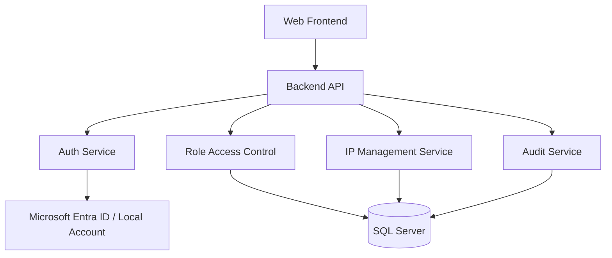

# 개발 설계 문서

## 1. 문서 목적
- 본 문서는 `0.System_Architecture.md`와 `1.Function_Design.md`를 구현 가능한 설계로 구체화한 최신 기준 문서다.
- 본 문서는 항상 최신 상태만 유지한다.
- `0` 또는 `1` 문서가 변경되면 구현 전에 반드시 본 문서를 함께 갱신해야 한다.
- 본 문서가 갱신된 후에만 실제 구현 작업을 진행한다.

## 2. 설계 기준
### 2.1 기술 방향
- 사내 Microsoft 계열 인증과의 친화성을 고려해 서버 백엔드는 `ASP.NET Core` 기반을 기본안으로 한다.
- 프론트엔드는 브라우저 기반 업무 UI를 제공하며 백엔드와 분리 가능한 구조로 설계한다.
- 운영 DB는 관계형 DB를 사용하며 권한, IP 자원, 로그를 정규화된 구조로 저장한다.

### 2.2 권장 구성
- 프론트엔드: `React + TypeScript`
- 백엔드: `ASP.NET Core Web API`
- 인증: `Microsoft Entra ID(OpenID Connect/OAuth 2.0)` + 내부 계정 로그인
- DB: `SQL Server`
- 배포: 사내 애플리케이션 서버 1식, 필요 시 리버스 프록시 분리

## 3. 논리 구조

## 4. 모듈 설계
### 4.1 인증 모듈
- SSO 로그인과 내부 계정 로그인을 공통 세션 모델로 통합한다.
- 로그인 성공 시 사용자 식별자, 표시 이름, 권한 정보를 세션 또는 토큰에 반영한다.
- 비활성 사용자 또는 권한 없는 사용자는 인증 후에도 접근을 차단한다.

### 4.2 권한 모듈
- 역할은 `SuperAdmin`, `Admin`, `User`의 3단계로 운영한다.
- UI 제어와 API 인가를 모두 역할 기준으로 구현한다.
- 시스템 핵심 관리 기능은 `SuperAdmin`만 수행 가능하게 한다.

### 4.3 IP 관리 모듈
- 네트워크 대역과 IP 자원을 분리된 엔터티로 관리한다.
- IP 생성 시 중복 주소, 대역 소속 여부, 상태 유효성을 검증한다.
- 삭제는 물리 삭제보다 논리 삭제를 우선 검토한다.

### 4.4 감사 로그 모듈
- 로그인, 로그아웃, IP CRUD, 권한 변경을 최소 기록 대상에 포함한다.
- 로그에는 수행 시각, 수행자, 기능, 대상, 변경 전 값, 변경 후 값을 저장한다.

## 5. 데이터 설계 초안
### 5.1 주요 테이블
| 테이블 | 설명 |
| --- | --- |
| `Users` | 시스템 사용자 |
| `Roles` | 역할 정의 |
| `UserRoles` | 사용자-역할 매핑 |
| `NetworkSegments` | 네트워크 대역 |
| `IPAddresses` | IP 자원 |
| `Assignments` | 현재 할당 정보 |
| `AuditLogs` | 감사 로그 |

### 5.2 주요 컬럼 초안
| 테이블 | 주요 컬럼 |
| --- | --- |
| `Users` | `UserId`, `LoginType`, `LoginKey`, `DisplayName`, `Department`, `IsActive` |
| `Roles` | `RoleId`, `RoleCode`, `RoleName` |
| `NetworkSegments` | `SegmentId`, `Name`, `CIDR`, `Gateway`, `VLAN`, `IsActive` |
| `IPAddresses` | `IpId`, `SegmentId`, `IPAddress`, `Hostname`, `Status`, `Description`, `IsDeleted` |
| `Assignments` | `AssignmentId`, `IpId`, `OwnerName`, `Department`, `AssignedAt`, `ReleasedAt` |
| `AuditLogs` | `AuditLogId`, `ActorUserId`, `ActionType`, `TargetType`, `TargetId`, `BeforeJson`, `AfterJson`, `CreatedAt` |

## 6. API 설계 초안
| 구분 | 메서드 | 경로 | 설명 |
| --- | --- | --- | --- |
| 인증 | `POST` | `/api/auth/login/local` | 내부 계정 로그인 |
| 인증 | `GET` | `/api/auth/login/m365` | Microsoft 365 로그인 시작 |
| 인증 | `POST` | `/api/auth/logout` | 로그아웃 |
| IP | `GET` | `/api/ip-addresses` | IP 목록 조회 |
| IP | `POST` | `/api/ip-addresses` | IP 등록 |
| IP | `PUT` | `/api/ip-addresses/{ipId}` | IP 수정 |
| IP | `DELETE` | `/api/ip-addresses/{ipId}` | IP 삭제 또는 비활성 |
| 대역 | `GET` | `/api/network-segments` | 대역 조회 |
| 대역 | `POST` | `/api/network-segments` | 대역 등록 |
| 사용자 | `GET` | `/api/users` | 사용자 조회 |
| 사용자 | `PUT` | `/api/users/{userId}/roles` | 역할 변경 |
| 로그 | `GET` | `/api/audit-logs` | 감사 로그 조회 |

## 7. 화면 설계 초안
- 로그인 화면: `Microsoft 365 로그인`, `내부 계정 로그인` 진입점 제공
- 대시보드: 대역별 사용 현황, 사용 가능 IP 수, 최근 변경 로그 요약
- IP 관리 화면: 검색, 필터, 목록, 상세, 등록/수정/삭제
- 대역 관리 화면: 대역 목록 및 상태 관리
- 사용자/권한 화면: 사용자 상태, 역할 부여/회수
- 감사 로그 화면: 기간/사용자/행위 기준 조회

## 8. 구현 순서
1. 인증 및 권한 모델 확정
2. DB 스키마 작성 및 마이그레이션 정의
3. IP/대역 CRUD API 구현
4. 감사 로그 공통 처리 구현
5. 프론트엔드 화면 구현
6. 통합 테스트 및 운영 배포 준비

## 9. 비기능 요구사항
- 내부망 환경에서 안정적으로 동작해야 한다.
- 주요 조회는 업무 사용에 지장이 없는 응답 속도를 목표로 한다.
- 모든 변경 행위는 추적 가능해야 한다.
- 권한 우회가 발생하지 않도록 서버 측 검증을 필수로 한다.

## 10. 문서 연계 규칙
- `0.System_Architecture.md`: 시스템 목적, 환경, 구성 관계의 최신 상태만 유지
- `1.Function_Design.md`: 기능/권한/정보 관계의 최신 상태만 유지
- `2.Dev_Design.md`: 위 두 문서를 반영한 구현 설계의 최신 상태만 유지
- `3.Dev_History.md`: 실제 구현 완료 이후 발생한 추가/수정/삭제 이력을 시간 순서대로 누적 기록
